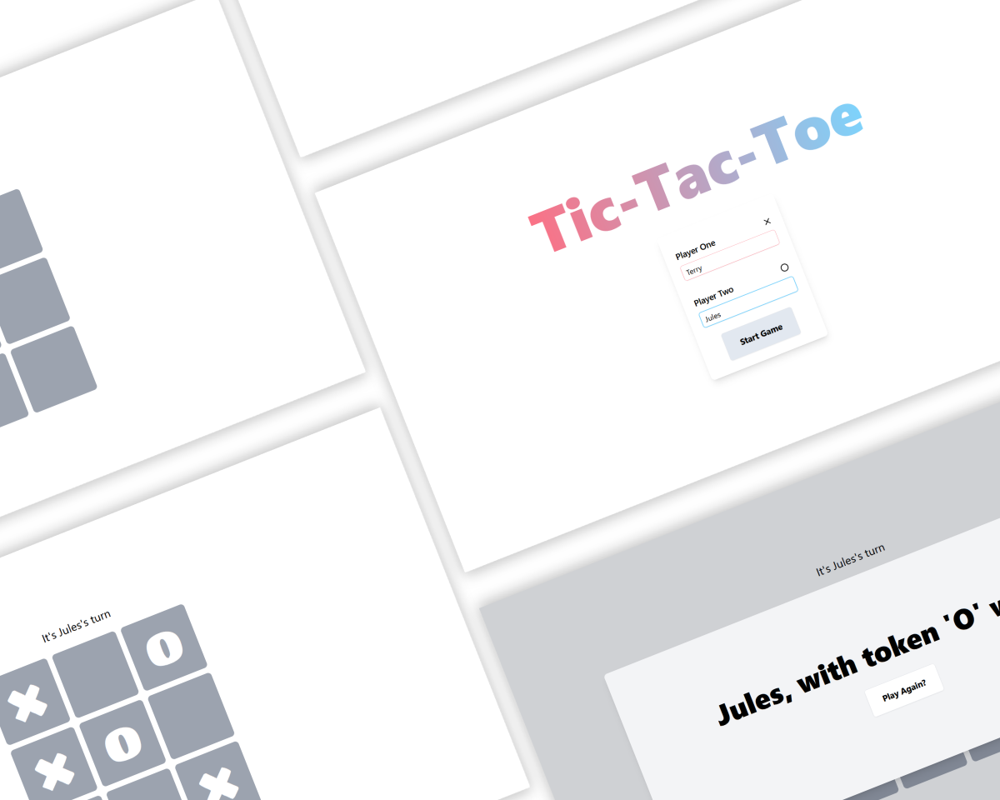

# Tic-Tac-Toe
Tic-Tac-Toe game project

Part of the Odin Project [Javascript Course](https://www.theodinproject.com/lessons/node-path-javascript-tic-tac-toe)

## Features
- Live preview [HERE](https://mlorenzm.github.io/tic-tac-toe/)
- Option to change username
- Reset button
- CSS done via Tailwind CSS 
- Two screens + a modal box dinamically generated via JS
- ESLint and Prettier configured

## Screenshots

## Known Limitations

- No "vs. CPU" mode

## Feedback

If you have any feedback, please reach me out at Discord: @maurito#0249

